# 
 Meters Reader (using YOLO and OpenCV) 
  

## Table of Contents   

1. [Problem statement](#problem)   
2. [Project navigation](#navigation)   
3. [Description of solution logic](#logic)    
4. [Example of a meter read](#performance_example)     
5. [How to run code on your device](#run_code)    
6. [Usage](#usage)    

## Problem statement 

[Table of Contents](#content)

The goal of this project is to read meter readings from a photo using **YOLOv8** and **OpenCV** library. To solve this task, I used a [dataset from Kaggle](https://www.kaggle.com/datasets/tapakah68/yandextoloka-water-meters-dataset) that contains 1244 meter images and masks. The sample data from this set looks like this:   

  

    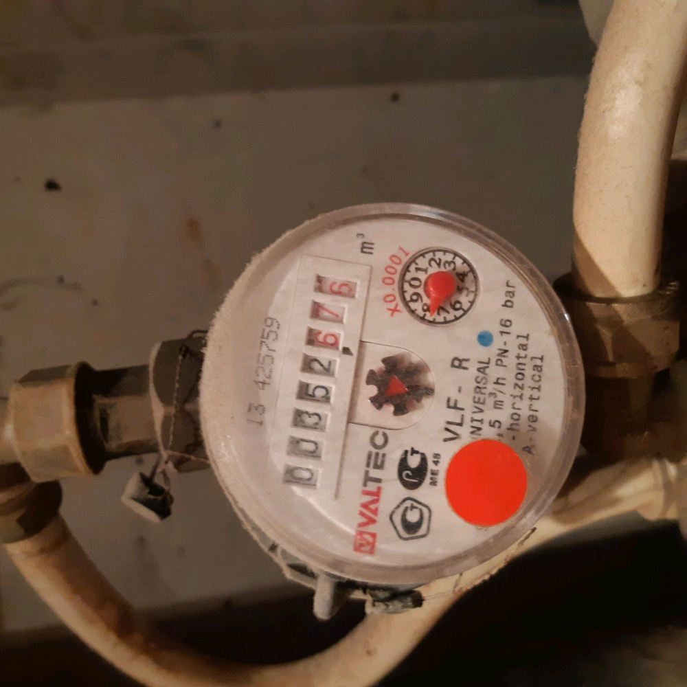
    
Image example

  

  
  

    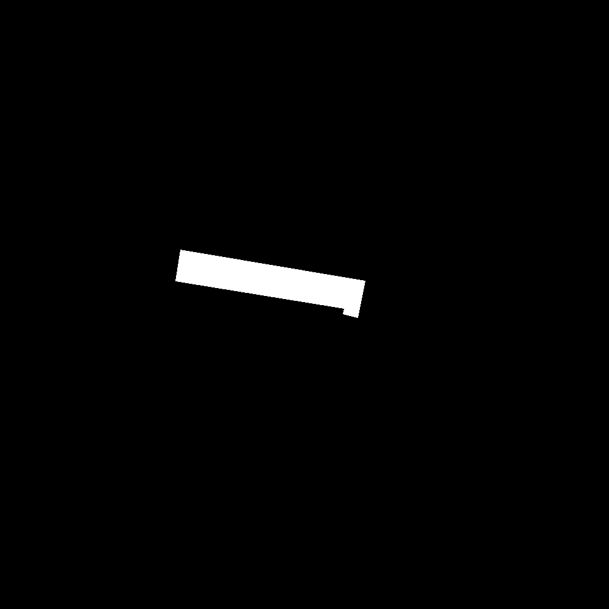
    
Mask example

  

   

## Project navigation   

[Table of Contents](#content)   

* `data` folder contains original dataset from Kaggle, data prepared for training YOLO segmentation and detection models, data of each preparation step, annotation labels for detection model training and my meter photos that I used to test program;
* `models` folder contains trained segmentation and detection models, that are neccessary for making predictions;
* `pics` folder contains the supporting images for this notebook;
* `predictions` folder contains couple of examples of how program reads meter readings;    
* `utils.py` file contains all the functions that I use for data preparation, models training and making prediction;  
* `main.py` file perform data preparations, models training and making prediction using functions from the `utils.py`;
* `yolo_segment.yaml` is the file that is needed for the YOLO segmentation model to understand where to look for training data. It contains directory paths and classes;
* `yolo_detect.yaml` is the file that is needed for the YOLO detection model to understand where to look for training data. It contains directory paths and classes;
* `yolov8n-seg.pt` is a YOLO segmentation model with trained weights that I use as the backbone;
* `yolov8s.pt` is a YOLO detection model with trained weights that I use as the backbone;
* `requirements.txt` is a list of required libraries and their versions.

## Description of solution logic   

[Table of Contents](#content)

There are 3 main steps in the solution:
1) [Training the segmentation model to identify the area with numbers in the meter image](#segment);
2) [Training an object detection model to classify each number in that zone](#detect);    
3) [Converting the prediction of the object detection model to the meter reading and saving the results](#pred2num)   

### 1. Training the segmentation model         

[Back to description plan](#logic)

As mentioned, I used the YOLOv8 models by ultralytics. In order to achieve faster training and higher model accuracy, I used transfer learning approach.   

Before training the YOLO segmentation model, there are a few preparatory steps to follow.  

First I converted the data structure to the form that YOLO requires. You can see the schema below:   

    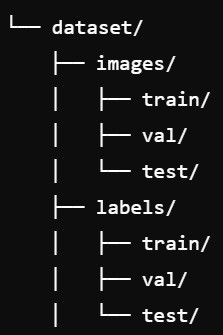
    

 

Next, I converted the masks to label format. This is a format that is also required for YOLO to work correctly.    

The last step in the preparation is to create a `yolo_segment.yaml` file. This contains path information for training, validation, and test data that helps YOLO find the data in the file system. The `.yaml` file looks like this:    

    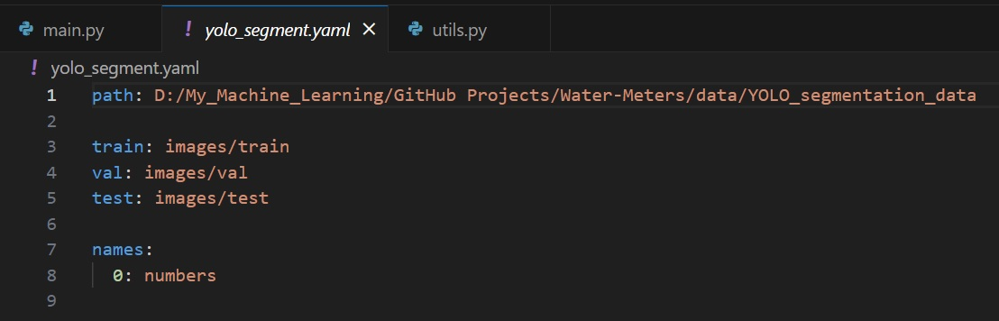
    

After all the preparations are done, I loaded the model `yolov8n-seg.pt` with trained weights. This is my backbone. Next, I trained the model on meter images for 10 epochs, and took the `best.pt` model to use.   

Resulting segmentation model gives such results: 

  

    
    
Image before segmentation

  

  
  

    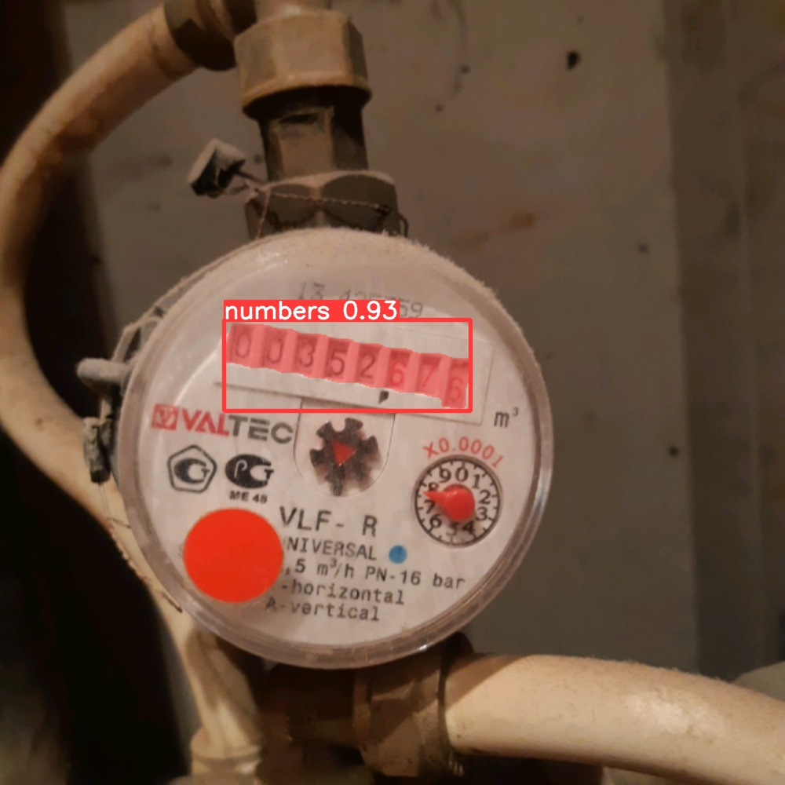
    
Segmented image

  

    

### 2. Training the object detection model         

[Back to description plan](#logic)

The preparations for training the object detection model are more complicated. I need to get same numbers format on each meter in order to train a versatile model.    
  

First, I apply segmentation masks to the meter images and save the results to the `data/masked_by_YOLO` folder.      

Example of masked image:   

  

    
    
Original image

  

  
  

    
    
Image masked by YOLO

  

Now my task is to carefully cut out the area with numbers.   
To do this, I first find the contour of the area with the numbers: 

    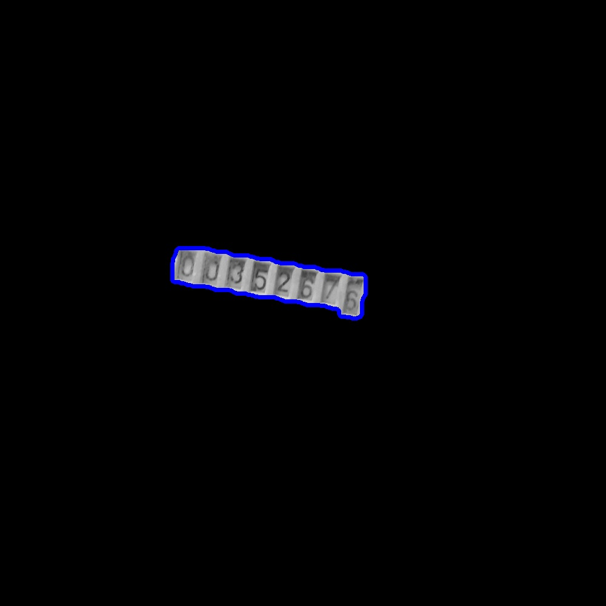
    
Found numbers contour

   

I then find the minimum rectangle that bounds this contour:    

    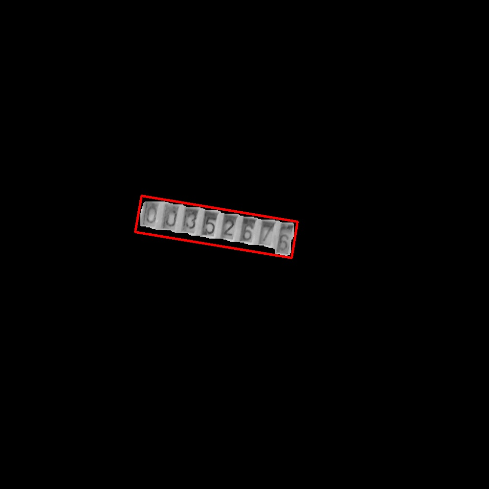
    
Found bounding rectangle

  

Now I find the vertices of this rectangle in order *top left -> top right -> bottom left -> bottom right*:       

    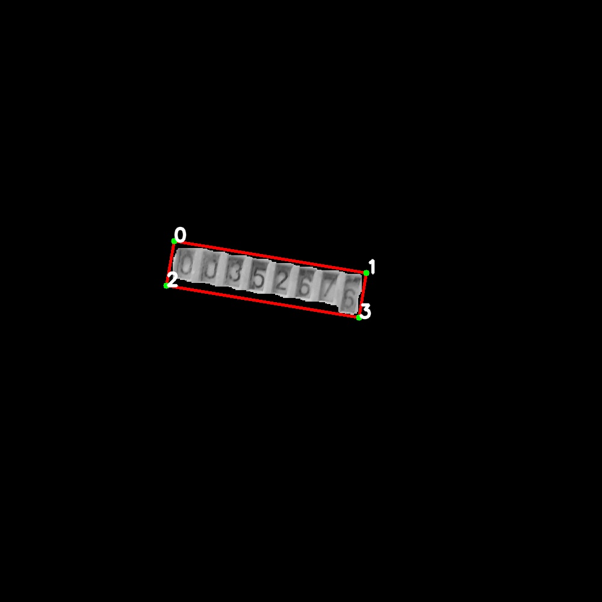
    
Found verticles

 

Now I check what is bigger: the distance between vertices 0 and 1 or between vertices 0 and 2 (is numbers zone rotated horizontally or vertically). Based on the results of the check, I rotate the image by stretching the corners of the rectangle to the corners of the image and resize it.   

The logic of the operation looks like this:   

  

    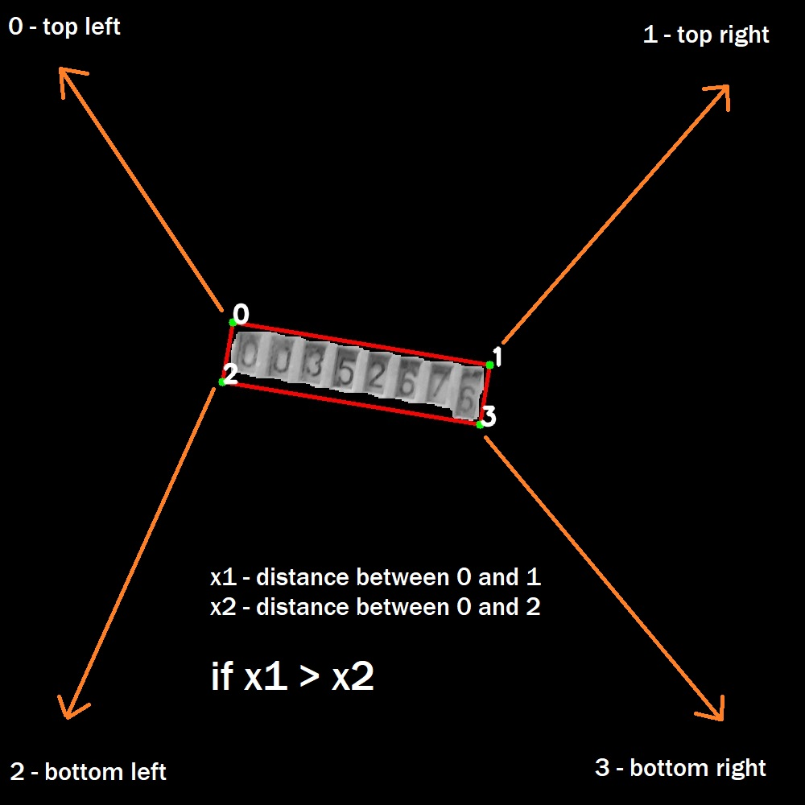
    
Horizontally rotated numbers

  

  
  

    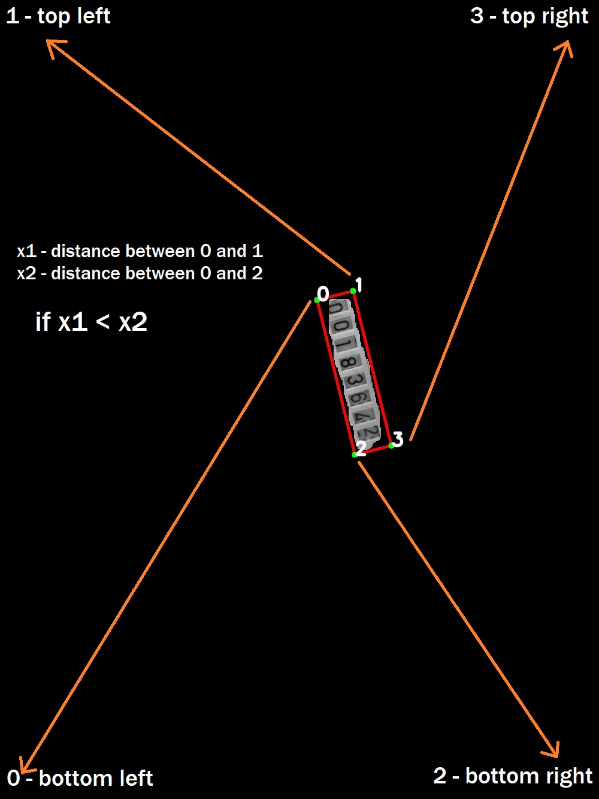
    
Vertically rotated numbers

  

**Pay attention to where the corners of the number area "go"!**   

After rotating with this strategy and resizing, I got cut out areas with numbers in the same format:  

  

    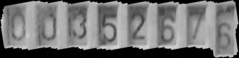
    
Cropped numbers from left image above

  

  
  

    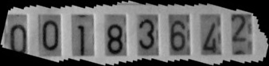
    
Cropped numbers from right image above

  

Cropped images are saved in `data/cropped_by_YOLO` folder   

Unfortunately, the original dataset don't have the annotated data needed to train the number classifier, so I had to do everything manually. I used the free service [CVAT.ai](https://www.cvat.ai/) to annotate the data. On each image, I marked out the area where the digit is located and assigned each digit a class from 0 to 9. In total, just over 9,000 figures were noted.   

An example of the image annotation looks like this. Here, each color corresponds to a specific class:   

    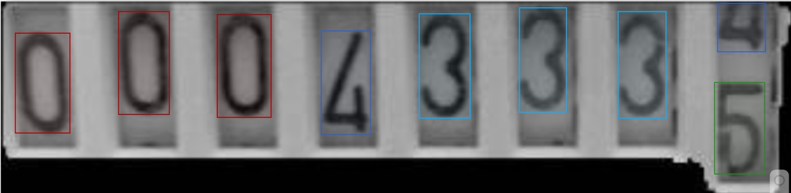
    
Example of annotation

 

*I chose a criterion for data annotation - if I can definitely recognize a digit, I annotate it, even if only part of the digit is visible.*

Some images turned out upside down. This was due to the unusual angle of the meter photo. Here is an example of such an image:   

    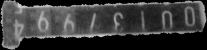
    
Example of upside-down image

 

I ignored the upside down images, as they are an absolute minority.   

I uploaded the annotated data in the format required for YOLO to work. It is important to remember that annotated data saved in `data/annotated_numbers_for_YOLO_detection/labels` is only suitable for data segmented with `yolov8n-seg.pt` for 10 epochs (`best.pt`).     

After that, I put the classifier training data into the same structure as for the segmentation model:  

    
    

  

The last step in the preparation is to create a `yolo_detect.yaml` file. This contains path information for training, validation, and test data that helps YOLO find the data in the file system. The `.yaml` file looks like this:    

    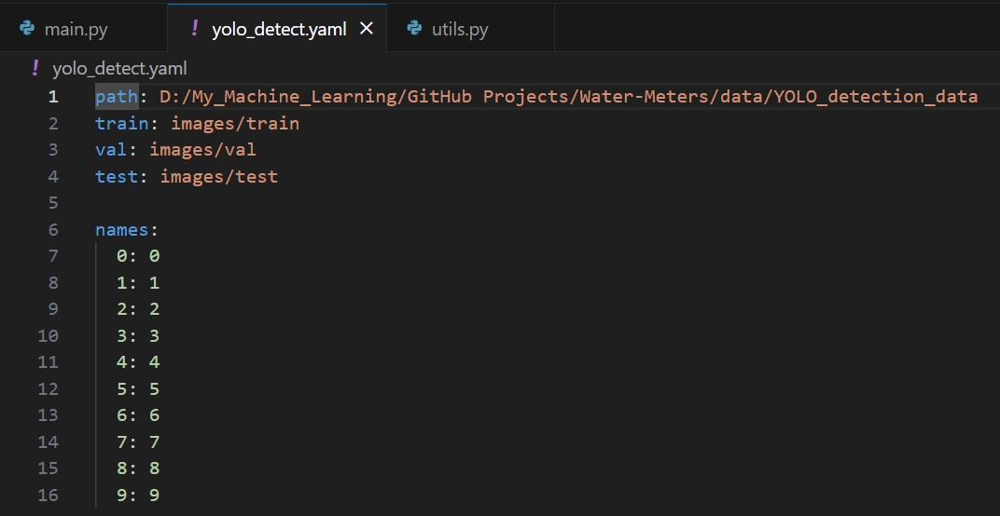
    

   

All preparations are made. Now I train `yolov8s.pt` for 20 epochs, and take the `best.pt` model for predictions.   

### Object detection model prediction to meter readings   

[Back to description plan](#logic)

The last thing left to do is to convert the model prediction into a number (meter readings).  

To do this, I sort the detected digits in order from left to right and remove all zeros from the beginning. 

It happens that the model recognizes two digits on the same vertical level. This happens most often on the last digit - where two digits can be clearly visible, as in the example below:    

  

    
    
Cropped image

  

  
  

    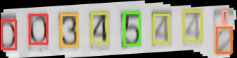
    
Detection model prediction

  

   

I leave the digit that has the larger height of the bounding box. Since the height of the digit is greater, it is more visible and it is a more honest meter reading.     
In this particular example, the height of the bounding box of the 2 is greater than the height of the bounding box of the 1, so we leave the 2.   

The last issue to solve is the floating comma. Meter readings have integer and fractional parts, but there is no single variant of how they are visually separated. They can be separated by a comma, by the color of the digits, by the color of the background, by different fonts, so it's not clear how to create a universal recognition algorithm.   

However, I noticed that meters fall into two types: either they have only 5 digits and no fractional part, or they have more than 6 digits and the fractional part takes 3 digits.  

Two types of meters:

  

    
    
More than 6 digits, 3 digits fract. part

  

  
  

    
    
5 digits, no fract. part

  

   

I don't know if this rule works on all the meters in the world, but in my dataset of 1244 images, there is not a single violation of this rule. Moreover, the meters in my house also follow it. You can check the meters in your home)   

So I just check how many digits the program detected. If it is less than 6, I take the reading as a integer. If there are more than 6 digits, I divide the integer by 1000, shifting the comma by 3 digits.   

And that's it. The project is done!    

## Example of a meter read   

[Table of Contents](#content) 

Below you can see examples of how the program works on the photos of the meters from my apartment:   

  

    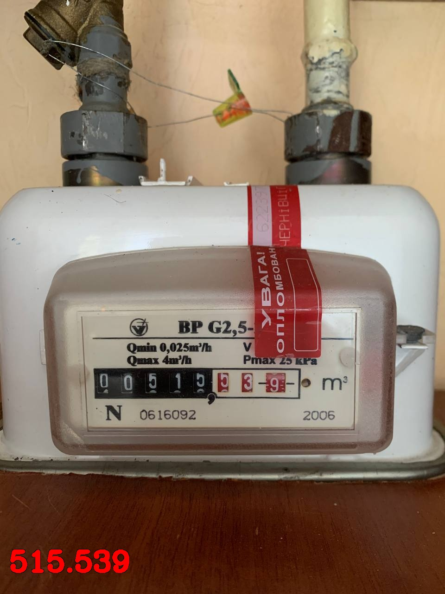
    

  

  
  

    
    

  

     

## How to run code on your device   

[Table of Contents](#content) 

To install all required dependencies, run the `requirements.txt` file from the root directory of the project:    
> pip install -r requirements.txt   

The `main.py` file contains variables that you can set to `True` to reproduce by yourself *data preparation for segmentation model training, segmentation model training, data preparation for object detection model training, object detection model training and prediction on the meter image.*     

    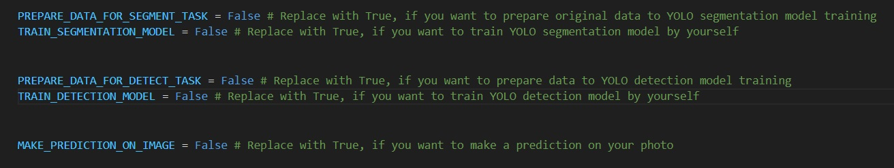
    

If you want to train models on your own, remember:   
* Data for training segmentation model is stored in `data/YOLO_segmentation_data`;
* Data for training object detection model is stored in `data/YOLO_detection_data`;
* Replace the `path` variable in `.yaml` files with the **absolute** path to `YOLO_segmentation_data` and `YOLO_detection_data` in your file system;
* If you don't have GPU on your computer and you don't want training to last forever, use GoogleColab or something similar.      

## Usage   

[Table of Contents](#content)  

If you want to read the meter readings from your image, here's what you need to do:  
1) Set `MAKE_PREDICTION_ON_IMAGE` in `main.py` to `True`;
2) Replace the values of the `image_path` and `path_to_save_predictions` variables (lines 88 and 91 in `main.py`) with the path to your image and the path where you want to save the prediction, respectively;
3) Execute the `main.py` file:   
> python main.py   

I hope you like the solution. Enjoy coding and have a good day!   